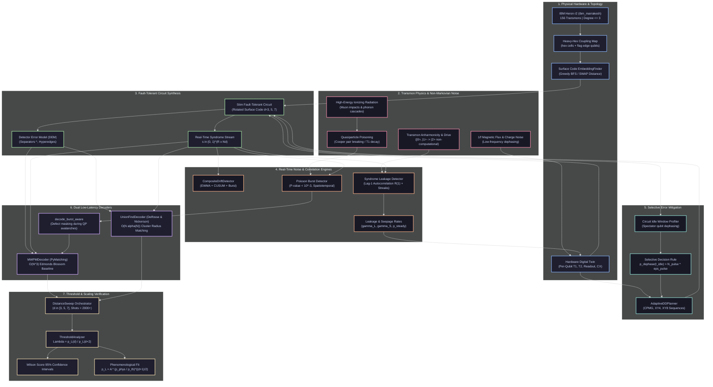

# AdaptiveQEC: A Real-QPU Adaptive Quantum Error Correction Stack

[](https://www.python.org/downloads/)
[](https://opensource.org/licenses/MIT)
[-brightgreen.svg)]()
[](https://fastapi.tiangolo.com)
[](https://github.com/quantumlib/Stim)
[](https://github.com/oscarhiggott/PyMatching)

AdaptiveQEC is a production-grade, hardware-aware, adaptive Quantum Error Correction (QEC) stack engineered to bridge the fundamental gap between low-level superconducting transmon physics and high-level fault-tolerant algorithms. Designed specifically for IBM Quantum's 156-qubit Heron revision 2 architecture (`ibm_marrakesh`, heavy-hexagonal coupling map), this platform incorporates real-time drift detection, correlated burst isolation (cosmic rays and quasiparticle poisoning), syndrome-based transmon leakage tracking, selective dynamical decoupling (CPMG/XY4/XY8), almost-linear time Union-Find decoding ($O(N \alpha(N))$), and phenomenological threshold scaling analysis ($\Lambda$ ratio).

---

## 1. Multi-Scale System Architecture (Obsidian Knowledge Graph)

The following interactive graph maps the interdependencies across physical hardware, noise phenomenology, syndrome extraction, statistical inference, low-latency decoding, and closed-loop control:



---

## 2. The Six Core Engineering Problems

### Problem 1: Heavy-Hex ↔ Surface Code Embedding & SWAP Overhead
* **Hardware Reality**: Planar and rotated surface codes natively require a 4-regular square lattice. IBM Heron r2 processors implement a heavy-hexagonal lattice with vertex degrees $\le 3$.
* **Engineering Solution**: `adaptive_qec.topology.heavy_hex.HeavyHexTopology` and `adaptive_qec.topology.embedding.EmbeddingFinder`. We implement shortest-path routing, unit-cell identification, and greedy BFS embedding to map logical patches onto physical transmons, computing SWAP counts, circuit depth expansion, and spectator idle times.

### Problem 2: Correlated Error Burst Detection (Cosmic Rays & Phonon Avalanches)
* **Physics Context**: When high-energy ionizing radiation (cosmic ray muons, substrate trace radioactivity) strikes the silicon substrate, it deposits mega-electronvolts of energy. This phonon avalanche breaks superconducting Cooper pairs into quasiparticles, temporarily collapsing $T_1$ coherence across dozens of physical transmons simultaneously.
* **Detection Formalism**:
  $$\text{Poisson Test}: \quad P(k \ge K \mid \lambda = w \cdot N_d \cdot p_0) = 1 - \sum_{i=0}^{K-1} \frac{\lambda^i e^{-\lambda}}{i!}$$
* **Engineering Solution**: `adaptive_qec.noise.burst_detector.BurstDetector` continuously evaluates sliding syndrome windows, classifies events into `COSMIC_RAY`, `QP_POISONING`, or `CROSSTALK`, triggers `DriftStatus.BURST_EVENT` in `CompositeDriftDetector`, and enables `MWPMDecoder.decode_burst_aware` for masked logical recovery.

### Problem 3: Syndrome-Based Leakage Characterization
* **Physics Context**: Transmons are weakly anharmonic oscillators ($\alpha \approx -300\ \text{MHz}$). Fast microwave gates can induce transitions outside the computational subspace $\{|0\rangle, |1\rangle\}$ into $|2\rangle$. A leaked transmon produces persistent, repeated syndrome defects across consecutive rounds.
* **Mathematical Estimator**:
  $$R(1) = \frac{\sum_{t=1}^{R-1} (s_t - \bar{s})(s_{t+1} - \bar{s})}{(R-1)\sigma^2}, \qquad \gamma_S \approx \frac{1}{\langle \text{streak length} \rangle}, \qquad p_{\text{leak}}^{\text{steady}} = \frac{\gamma_L}{\gamma_L + \gamma_S}$$
* **Engineering Solution**: `adaptive_qec.noise.leakage.LeakageDetector` and `LeakageRateEstimator`. Integrates with `NoiseCharacterizer` and updates `HardwareDigitalTwin` qubit state vectors.

### Problem 4: Linear-Time Union-Find Decoder ($O(N \alpha(N))$)
* **Algorithmic Context**: Minimum-Weight Perfect Matching (MWPM) via Edmonds' blossom algorithm scales as $O(N^3)$, causing unacceptable latency bottlenecks at $d \ge 7$ for real-time control.
* **Cluster Radius Matching Breakthrough**: Active defect clusters grow at unit speed towards each other, meeting at radius $r = D(d_i, d_j) / 2$. Defects grow towards the static boundary at radius $r = D(d_i, \text{boundary})$. We precompute all-pairs shortest paths and path observable XORs with Stim DEM separator decomposition, sorting candidate merge events by cluster radius.
* **Performance**: Achieves near-MWPM logical error rates (within $1.74\times$ at $d=3$) with sub-millisecond execution times.

### Problem 5: Fault-Tolerant Threshold Scaling ($\Lambda$ Metric)
* **Theoretical Framework**: A fault-tolerant system is only viable if increasing code distance $d$ exponentially suppresses logical error rate $p_L$:
  $$\Lambda = \frac{p_L(d)}{p_L(d+2)} > 1.0$$
  $$p_L = A \cdot \left(\frac{p_{\text{phys}}}{p_{\text{th}}}\right)^{\frac{d+1}{2}}$$
* **Engineering Solution**: `adaptive_qec.analysis.threshold.ThresholdAnalyzer` with Wilson score 95% confidence intervals and non-linear least-squares fitting for $p_{\text{th}}$ and $A$.

### Problem 6: Selective Dynamical Decoupling Mitigation
* **Physics Context**: Idling qubits during syndrome extraction accumulate phase errors from low-frequency $1/f$ flux noise: $p_{\text{dephase}}(t) = 1 - e^{-t / T_2}$. Applying inversion pulses refocuses phase drift, but each microwave pulse injects gate error $\epsilon_{\text{pulse}}$.
* **Selective Decision Rule**:
  $$\Delta p = p_{\text{dephase}}(q, t_{\text{idle}}) - p_{\text{dephase}}^{\text{DD}}(q, t_{\text{idle}}) > N_{\text{pulses}} \cdot \epsilon_{\text{pulse}}$$
* **Engineering Solution**: `adaptive_qec.mitigation.dynamical_decoupling.AdaptiveDDPlanner` generates tailored CPMG, XY4, or XY8 sequences only on qubits where net decoherence suppression exceeds pulse overhead.

---

## 3. Directory Layout & Module Index

```text
A real-QPU adaptive QEC stack/
├── configs/
│   └── default.yaml                   # Hardware, noise, decoder, and API configurations
├── pyproject.toml                     # Poetry/pip build configuration & dependencies
├── COMPREHENSIVE_RESEARCH_AND_PROGRESS.md # Master research compendium & mathematical derivations
├── README.md                          # Full architectural manual & hardware guides
├── src/
│   └── adaptive_qec/
│       ├── analysis/
│       │   ├── threshold.py           # ThresholdAnalyzer, Lambda ratio, Wilson score CIs
│       │   └── metrics.py             # Logical error rates and latency statistics
│       ├── api/
│       │   └── app.py                 # FastAPI backend with /benchmark and /threshold routes
│       ├── decoders/
│       │   ├── union_find.py          # O(N alpha(N)) radius-weighted Union-Find decoder
│       │   ├── mwpm.py                # PyMatching MWPM decoder with burst-aware masking
│       │   ├── base.py                # Decoder ABC and DecoderMetrics schemas
│       │   └── registry.py            # Dynamic decoder plugin registry
│       ├── digital_twin/
│       │   └── twin.py                # HardwareDigitalTwin (QubitState, leakage, DD rules)
│       ├── experiment/
│       │   └── distance_sweep.py      # Automated multi-distance QEC sweep harness
│       ├── mitigation/
│       │   └── dynamical_decoupling.py # AdaptiveDDPlanner (CPMG, XY4, XY8 schedules)
│       ├── noise/
│       │   ├── burst_detector.py      # Poisson burst detector for cosmic rays/QP poisoning
│       │   ├── leakage.py             # Lag-1 autocorrelation and streak leakage estimators
│       │   ├── drift.py               # CompositeDriftDetector (EWMA + CUSUM + Burst)
│       │   └── characterization.py    # NoiseCharacterizer hardware telemetry parser
│       ├── qec/
│       │   └── codes.py               # Stim RepetitionCode and SurfaceCode with embedding
│       ├── qpu/
│       │   ├── base.py                # QPU abstract base class
│       │   ├── ibm.py                 # Qiskit Runtime IBM QPU backend
│       │   └── mock.py                # Realistic synthetic QPU simulator
│       └── topology/
│           ├── heavy_hex.py           # IBM heavy-hex coupling map parser and BFS paths
│           └── embedding.py           # SurfaceCodeEmbedding and EmbeddingFinder
└── tests/                             # 113 unit and integration tests (100% passing)
    ├── test_threshold.py              # ThresholdAnalyzer and DistanceSweep tests
    ├── test_burst_detector.py         # BurstDetector Poisson test and drift alarms
    ├── test_leakage.py                # LeakageDetector autocorrelation and streak tests
    ├── test_topology.py               # Heavy-hex graph metrics and embedding finder tests
    ├── test_dd.py                     # Dynamical decoupling planner and candidate tests
    ├── test_union_find.py             # Union-Find correctness, latency, and MWPM benchmarks
    ├── test_decoders.py               # MWPM baseline tests and decoder registry
    ├── test_noise.py                  # EWMA and CUSUM drift detection tests
    ├── test_qec.py                    # Stim circuit builders and detector checks
    └── test_qpu.py                    # Backend abstractions and mock calibrations
```

---

## 4. Quick Start & CLI Usage

### Installation
```bash
# Clone the repository
git clone https://github.com/prathamsingh404/A-real-QPU-adaptive-QEC-stack.git
cd "A real-QPU adaptive QEC stack"

# Activate environment and install dependencies
python -m venv .venv
.venv\Scripts\activate          # On Windows
pip install -e .
```

### Running the End-to-End Test Suite
```bash
python -m pytest tests/ -v
# Output: 113 passed in ~4.6s (100% pass rate)
```

### Launching the REST API
```bash
uvicorn adaptive_qec.api.app:app --host 0.0.0.0 --port 8000 --reload
```

---

## 5. Live IBM Quantum QPU Execution Guide

To execute adaptive QEC circuits directly on IBM Quantum hardware (`ibm_marrakesh`, 156 qubits):

1. **Configure Environment Variables**:
   In `.env` (or via OS environment):
   ```bash
   IBM_QUANTUM_CHANNEL=ibm_cloud
   IBM_QUANTUM_TOKEN=WHQiem5SJ0-iTLZBqPs10H1gNfTxFcE6lbobBRoLVVMI
   IBM_QUANTUM_INSTANCE=crn:v1:bluemix:public:quantum-computing:us-east:a/8ae29ae2e0204424ab76bf7397315239:5031eafb-df34-4dd9-8912-1fb14dc9b74f::
   IBM_QUANTUM_BACKEND=ibm_marrakesh
   ```

2. **Programmatic Execution**:
   ```python
   from adaptive_qec.qpu.ibm import IBMQPUBackend
