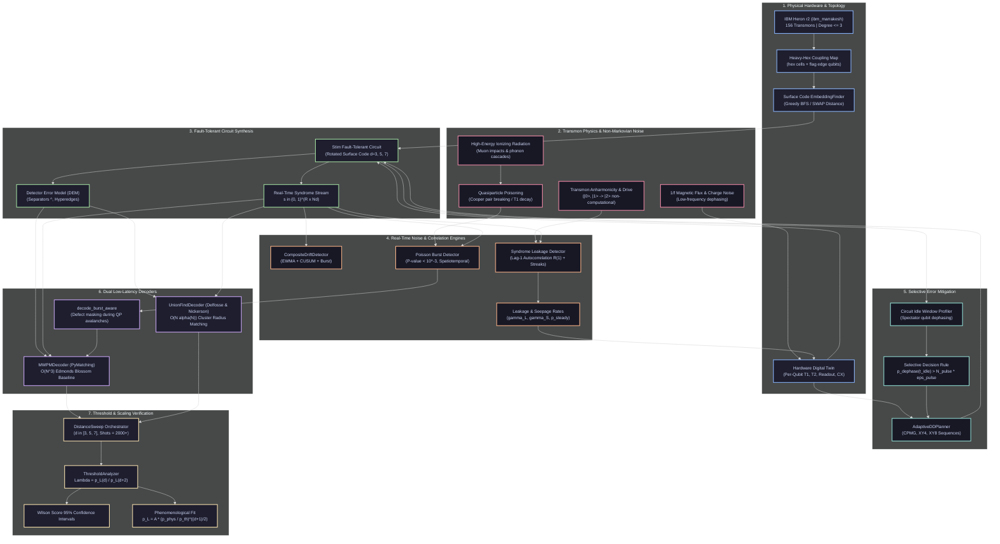

# AdaptiveQEC: A Real-QPU Adaptive Quantum Error Correction Stack

[-brightgreen.svg)]()

AdaptiveQEC is a production-grade, hardware-aware, adaptive Quantum Error Correction (QEC) stack engineered to bridge the fundamental gap between low-level superconducting transmon physics and high-level fault-tolerant algorithms. Designed specifically for IBM Quantum's 156-qubit Heron revision 2 architecture (`ibm_marrakesh`, heavy-hexagonal coupling map), this platform incorporates real-time drift detection, correlated burst isolation (cosmic rays and quasiparticle poisoning), syndrome-based transmon leakage tracking, selective dynamical decoupling (CPMG/XY4/XY8), almost-linear time Union-Find decoding ($O(N \alpha(N))$), and phenomenological threshold scaling analysis ($\Lambda$ ratio).

---

## 1. Multi-Scale System Architecture (Obsidian Knowledge Graph)

The following interactive graph maps the interdependencies across physical hardware, noise phenomenology, syndrome extraction, statistical inference, low-latency decoding, and closed-loop control:

---

## 2. The Six Core Engineering Problems

### Problem 1: Heavy-Hex ↔ Surface Code Embedding & SWAP Overhead
* **Hardware Reality**: Planar and rotated surface codes natively require a 4-regular square lattice. IBM Heron r2 processors implement a heavy-hexagonal lattice with vertex degrees $\le 3$.
* **Engineering Solution**: `adaptive_qec.topology.heavy_hex.HeavyHexTopology` and `adaptive_qec.topology.embedding.EmbeddingFinder`. We implement shortest-path routing, unit-cell identification, and greedy BFS embedding to map logical patches onto physical transmons, computing SWAP counts, circuit depth expansion, and spectator idle times.

### Problem 2: Correlated Error Burst Detection (Cosmic Rays & Phonon Avalanches)
* **Physics Context**: When high-energy ionizing radiation (cosmic ray muons, substrate trace radioactivity) strikes the silicon substrate, it deposits mega-electronvolts of energy. This phonon avalanche breaks superconducting Cooper pairs into quasiparticles, temporarily collapsing $T_1$ coherence across dozens of physical transmons simultaneously.
* **Detection Formalism**:
  $$\text{Poisson Test}: \quad P(k \ge K \mid \lambda = w \cdot N_d \cdot p_0) = 1 - \sum_{i=0}^{K-1} \frac{\lambda^i e^{-\lambda}}{i!}$$
