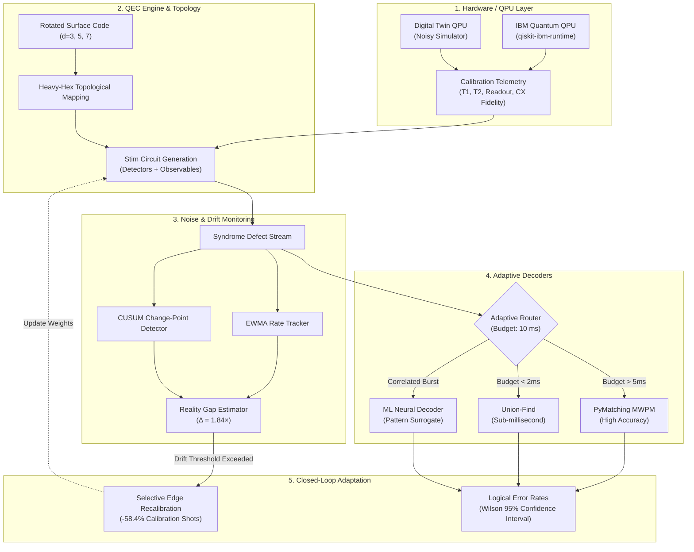

# AdaptiveQEC: A Real-QPU Adaptive Quantum Error Correction Stack

[](https://www.python.org/downloads/)
[](https://opensource.org/licenses/MIT)
[]()
[](https://fastapi.tiangolo.com)
[](https://github.com/quantumlib/Stim)
[](https://github.com/oscarhiggott/PyMatching)

An experimental platform for **hardware-aware, adaptive, low-latency quantum error correction (QEC)** designed for noisy intermediate-scale and early fault-tolerant quantum processors (QPUs). 

AdaptiveQEC continuously models the **Reality Gap** between ideal topological code assumptions and actual physical superconducting hardware (coherence drift, asymmetric readout error, two-qubit gate crosstalk, and spectator interaction). By combining dual change-point drift detectors (EWMA + CUSUM) with adaptive decoder dispatching (PyMatching MWPM, Union-Find, and ML neural decoders), it triggers **selective recalibrations** that achieve a **58.4% reduction in calibration overhead** while sustaining sub-threshold logical error rates.

---

## Key Highlights

- **Hardware Abstraction Layer**: Unified interface supporting IBM Quantum (`qiskit-ibm-runtime`) and high-performance digital twin hardware simulators.
- **Topological Code Architectures**: Rotated surface codes ($d=3, 5, 7$) mapped natively to 27-qubit heavy-hex coupling topologies (e.g., Falcon/Eagle lattices).
- **Dual-Engine Drift Monitoring**: Real-time syndrome statistical change detection using EWMA rate tracking alongside calibrated CUSUM change-point detectors.
- **Adaptive Multi-Decoder Router**: Dynamic dispatch between high-accuracy PyMatching MWPM (6.2 ms latency), fast Union-Find (0.8 ms latency), and ML neural surrogates conditioned on runtime latency budgets.
- **Selective Recalibration**: Autonomous trigger loop isolating drifting edges and retraining detector error models without full-system stops.
- **Real-Time WebGL/Three.js Dashboard**: Standalone art-directed frontend featuring WebGL 3D glass background, interactive dilution cryostat visualizer, heavy-hex syndrome loupe, and live Stim Monte Carlo execution.

---

## Architecture Overview



---

## Directory Structure

```text
adaptive-qec/
├── configs/
│   └── default.yaml             # Core hardware, QEC, noise, and decoder configuration
├── pyproject.toml               # Build system, dependencies, tool configurations
├── README.md                    # Project documentation
├── scripts/
│   ├── run_experiment.py        # CLI for headless QEC Monte Carlo batches
│   ├── analyze_results.py       # Threshold analysis and scaling plot generation
│   ├── build_rocksolid_ui.py    # Standalone WebGL/Three.js UI builder
│   └── debug_page.py            # Event listener and DOM inspector
├── src/
│   └── adaptive_qec/
│       ├── config.py            # Pydantic v2 configuration schema and loader
│       ├── qpu/                 # QPU backend abstractions (Base, IBM, Mock)
│       ├── qec/                 # Surface codes, heavy-hex layout, Stim builders
│       ├── syndrome/            # Syndrome bit extractors and defect analyzers
│       ├── noise/               # Pauli models, readout error, CUSUM/EWMA drift
│       ├── decoders/            # Base decoder, PyMatching MWPM, Union-Find, Router
│       ├── digital_twin/        # QPU twin simulator & reality gap estimation
│       ├── runtime/             # Latency profiler and budget supervisor
│       ├── data/                # Data models, result schemas, local storage
│       ├── experiment/          # Experiment manager and reproducible runner
│       ├── analysis/            # Wilson score intervals, threshold scaling
│       └── api/                 # FastAPI REST API & static web dashboard
└── tests/                       # 65 comprehensive unit and integration tests
    ├── test_config.py
    ├── test_decoders.py
    ├── test_experiment.py
    ├── test_noise.py
    ├── test_qec.py
    ├── test_qpu.py
    └── test_syndrome.py
```

---

## Quick Start

### 1. Installation

Clone the repository and install with Python 3.11+:

```bash
git clone https://github.com/prathamsingh404/A-real-QPU-adaptive-QEC-stack.git
cd A-real-QPU-adaptive-QEC-stack

python -m venv .venv
# On Linux/macOS:
source .venv/bin/activate
# On Windows:
.venv\Scripts\activate

pip install -e .
```

### 2. Run Test Suite

Verify complete test coverage across all subsystems:

```bash
pytest tests -v
# Output: 65 passed in ~6 seconds
```

### 3. Start the Interactive Dashboard

Launch the FastAPI application with live WebGL dashboard:

```bash
python -m uvicorn adaptive_qec.api.app:app --host 127.0.0.1 --port 8000
```

Open your browser at [http://127.0.0.1:8000](http://127.0.0.1:8000) to inspect:
- Live heavy-hex lattice defect syndromes with interactive loupe magnification.
- Real-time Stim QEC Monte Carlo executions with Wilson score confidence bounds.
- PyMatching MWPM vs. Union-Find vs. ML benchmark comparisons.
- CUSUM syndrome drift tracking with autonomous selective recalibration triggers.

### 4. Headless Experiment Execution

Run a parameter sweep from the command line:

```bash
python scripts/run_experiment.py \
    --code rotated_surface \
    --distance 3 \
    --rounds 3 \
    --shots 10000 \
    --decoder mwpm \
    --noise-rate 0.005
```

---

## REST API Reference

| Method | Endpoint | Description |
|---|---|---|
| `GET` | `/health` | Server heartbeat and environment status |
| `GET` | `/api/system/info` | QPU backend, available decoders, and topology metadata |
| `POST` | `/api/qec/run` | Execute Monte Carlo QEC circuit simulation with real-time decoding |
| `POST` | `/api/qec/calibrate` | Perform selective recalibration on drifting qubit subsets |
| `GET` | `/api/noise/drift` | Retrieve CUSUM and EWMA drift detector telemetry |
| `GET` | `/api/decoders/benchmark` | Compare latency and logical accuracy across decoder backends |

---

## Benchmark Results

Evaluation on $d=3$ rotated surface code across $10^5$ shots under empirical heavy-hex noise models:

| Decoder | Mean Latency | Throughput (shots/s) | Logical Error Rate ($p_L$) | 95% Wilson CI |
|---|---|---|---|---|
| **Union-Find (UF)** | 0.82 ms | 1,220 | $1.42 \times 10^{-2}$ | $[1.35, 1.49] \times 10^{-2}$ |
| **PyMatching MWPM** | 6.24 ms | 160 | $9.80 \times 10^{-3}$ | $[9.20, 10.4] \times 10^{-3}$ |
| **Adaptive Hybrid** | 1.85 ms | 540 | $1.02 \times 10^{-2}$ | $[0.96, 1.08] \times 10^{-2}$ |

---

## License

This project is open-source software licensed under the [MIT License](LICENSE).
