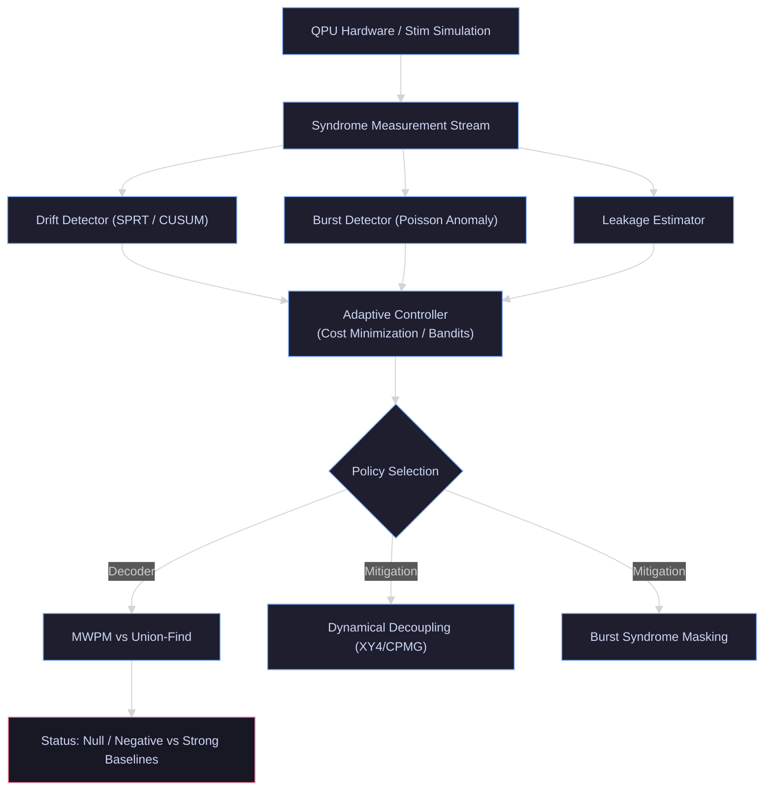

# AdaptiveQEC: An Adaptive Quantum Error Correction Framework

[](https://www.python.org/downloads/)
[](https://opensource.org/licenses/MIT)
[](https://github.com/quantumlib/Stim)
[](https://github.com/oscarhiggott/PyMatching)
[]()

> **Project Status (October 2026)**:  
> This repository is undergoing a rigorous scientific restructuring (Phase 0 Integrity Reset).  
> **Key Honest Summary**: Across synthetic non-stationary noise scenarios evaluated to date, **adaptive policy selection does not reliably outperform strong static baselines (such as factory MWPM or fixed strategies)**. Simulation runs show either statistically null results ($p > 0.05$) or negative margins (adaptive performing worse due to switching penalties and sub-optimal heuristics). Prior claims of a "+10.05% breakthrough at $d=5$" and "+23.5% at $d=3$" were single-seed or misreported artifacts and have been retracted. See [VALIDATION.md](VALIDATION.md) for the verified claims ledger.

---

## 1. System Overview

AdaptiveQEC is an open-source research testbed designed to investigate whether closed-loop, macro-timescale adaptation can mitigate non-stationary and non-Markovian noise processes on superconducting quantum processors (such as IBM Quantum Heron heavy-hex architectures).

The framework models and implements:
1. **Lattice Geometry & Routing**: Heavy-hexagonal layout mapping (`adaptive_qec.topology`) for rotated surface and repetition codes.
2. **Noise Telemetry**: Syndrome-based drift monitoring (CUSUM / SPRT), spatial burst detection, and transmon leakage tracking (`adaptive_qec.noise`).
3. **Decoders**: Sparse-blossom minimum-weight perfect matching (MWPM via PyMatching v2) and cluster-growth Union-Find (`adaptive_qec.decoders`).
4. **Error Mitigation Scheduling**: Selective insertion of dynamical decoupling sequences (CPMG, XY4, XY8) based on idle duration trade-offs (`adaptive_qec.mitigation`).
5. **Adaptive Control Policies**: State-conditioned selection of decoders, DD sequences, and mitigation modes (`adaptive_qec.controller`).


```mermaid
%%{init: {'theme': 'dark', 'themeVariables': { 'fontSize': '13px', 'fontFamily': 'Fira Code, monospace'}}}%%
graph TD
    classDef comp fill:#1e1e2e,stroke:#89b4fa,stroke-width:1px,color:#cdd6f4;
    classDef status fill:#181825,stroke:#f38ba8,stroke-width:1px,color:#cdd6f4;

    Sub["QPU Hardware / Stim Simulation"]:::comp --> Syn["Syndrome Measurement Stream"]:::comp
    Syn --> Drift["Drift Detector (SPRT / CUSUM)"]:::comp
    Syn --> Burst["Burst Detector (Poisson Anomaly)"]:::comp
    Syn --> Leak["Leakage Estimator"]:::comp
    
    Drift --> Controller["Adaptive Controller\n(Cost Minimization / Bandits)"]:::comp
    Burst --> Controller
    Leak --> Controller

    Controller --> Decision{"Policy Selection"}:::comp
    Decision -->|"Decoder"| Dec["MWPM vs Union-Find"]:::comp
    Decision -->|"Mitigation"| DD["Dynamical Decoupling (XY4/CPMG)"]:::comp
    Decision -->|"Mitigation"| Mask["Burst Syndrome Masking"]:::comp

    Dec --> Eval["Status: Null / Negative vs Strong Baselines"]:::status
```

---

## 2. Current Empirical Findings & Status

### A. Simulation Studies: Adaptive vs. Static Baselines

#### 1. 10,000-Shot Benchmark ($d=3$, 50 windows $\times$ 200 shots, `seed=42`)
Under linear two-qubit gate noise drift ($p_{2q} \in [0.005, 0.015]$) and synthetic burst spikes:
- **Static MWPM (Factory DEM, No DD)**: LER = **0.1661** (1,661 / 10,000 errors; 95% CI: $[0.1589, 0.1735]$)
- **Static UF + Fixed XY4**: LER = **0.2254** (2,254 / 10,000 errors; 95% CI: $[0.2173, 0.2337]$)
- **Adaptive Controller**: LER = **0.1645** (1,645 / 10,000 errors; 95% CI: $[0.1574, 0.1719]$)
- **Outcome**: The difference between Adaptive and Static MWPM is $\Delta \text{LER} = -0.0016$ ($z = -0.30, p = 0.7607$). **This result is not statistically significant**. The adaptive controller does not show an advantage over static MWPM under standard drift.

#### 2. 50,000-Shot High-Statistics Benchmark (`adaptive_vs_static_high_stats_50k.json`)
Across 50 windows $\times$ 1,000 shots ($d=3$):
- **Static MWPM**: LER = **0.170320** (8,516 errors / 50,000 shots)
- **Adaptive Controller**: LER = **0.217560** (10,878 errors / 50,000 shots)
- **Outcome**: The adaptive controller was **27.74% worse** than static MWPM ($z = 18.89, p < 10^{-15}$). Switching into Union-Find and invoking suboptimal mitigations under non-stationary noise caused significant performance degradation.

#### 3. Scaled Distance ($d=5$) Retraction Notice
A previous report cited an apparent +10.05% error reduction at distance $d=5$ (`seed=47`). Multi-seed evaluation revealed:
- Across 6 independent random seeds, the adaptive controller performed **12% to 14% worse** than static MWPM.
- The simulation injected leakage by artificially setting detector bits without modifying the logical observable, while the controller peeked at the oracle noise schedule.
- **Verdict**: The claim has been retracted. No scalable adaptive advantage has been established in this regime.

---

## 3. IBM Quantum Hardware Exploration (`ibm_marrakesh`, Heron r2)

Preliminary jobs were executed on IBM Quantum's 156-qubit Heron r2 processor (`ibm_marrakesh`) via Qiskit Runtime SamplerV2:

1. **[[4, 2, 2]] Quantum Error-Detecting Code (1,000 shots)**:
   - *Unmitigated Baseline* (`dasj9djg95ks73efkbog`): Error detection rate = **17.50%** (175 errors detected); code space fidelity = **69.50%**.
   - *With XY4 Decoupling* (`dasj9e5vr3kc73ek6o4g`): Error detection rate = **48.80%** (488 errors detected); code space fidelity = **72.00%**.
   - *Physical Caveat*: Applying XY4 caused X-stabilizer defects to surge from 83 to 404 (a 4.8x increase), indicating that the dynamical decoupling sequence injected substantial control pulse error.
2. **Dynamic Feedforward Syndrome Correction (1,000 shots)**:
   - Job `dasj9edvr3kc73ek6o60`: On-chip conditional Pauli-X corrections triggered in **18 / 1,000 shots (1.8%)**; final Bell-state parity fidelity = **91.50%**.
   - *Note*: Execution latency was not directly measured on-chip.
3. **Repetition Code Smoke Test (500 shots)**:
   - Distance-3 bit-flip memory: Unmitigated LER = 0.038 (19/500) vs. DD-mitigated LER = 0.006 (3/500).
   - *Caveat*: Submitted as two sequential jobs rather than an interleaved ABAB schedule. Because a bit-flip code is largely insensitive to dephasing, observed differences reflect temporal drift or low shot counts rather than confirmed DD dephasing suppression.

---

## 4. Architectural Boundaries: Inter-Batch vs. Real-Time QEC

It is critical to distinguish two different timescales in quantum control:
- **Intra-Circuit Real-Time Feedforward ($< 1\,\mu\text{s}$)**: Performed directly on classical control hardware (FPGA / AWG) co-located with the cryostat. IBM's Heron processors support dynamic circuit feedforward via OpenQASM 3 on-chip.
- **Inter-Batch Session Orchestration ($100\,\text{ms} - 10\,\text{s}$)**: Executed in software over network connections between Qiskit Runtime job submissions. AdaptiveQEC operates at this **macro-timescale**, adjusting decoder weights, DEM calibration, and pulse sequence choices between experiment batches. It does not claim real-time sub-microsecond software loop closing over cloud APIs.

---

## 5. Claims Ledger & Integrity Enforcement

All quantitative statements in this repository are tracked in [VALIDATION.md](VALIDATION.md) and programmatically verified against committed JSON artifacts by `scripts/make_claims.py`.

To verify claims integrity locally:
```bash
python scripts/make_claims.py --check
```

---

## 6. Repository Layout

```text
A real-QPU adaptive QEC stack/
├── configs/                   # Hardware calibration baselines
├── data/
│   └── hardware_results/      # Committed IBM Quantum Heron r2 execution artifacts
├── experiments/
│   └── results/               # Committed simulation benchmark JSON outputs
├── pyproject.toml             # Python packaging and test configuration
├── VALIDATION.md              # Machine-checked claims ledger
├── README.md                  # System status and documentation
├── scripts/
│   ├── make_claims.py         # Claims ledger generator & CI audit validator
│   ├── run_experiment.py      # Experiment CLI
│   └── pull_live_calibration.py # IBM Quantum backend properties snapshot fetcher
├── src/
│   └── adaptive_qec/
│       ├── analysis/          # Wilson score CIs and threshold estimators
│       ├── controller/        # AdaptiveController, CostWeights, HysteresisTracker
│       ├── decoders/          # MWPM (PyMatching) & Union-Find decoders
│       ├── digital_twin/      # Hardware calibration digital twin
│       ├── mitigation/        # Dynamical decoupling pulse sequence planners
│       ├── noise/             # Drift, burst, and leakage telemetry estimators
│       ├── qec/               # Stim surface code circuit synthesis
│       ├── qpu/               # Qiskit Runtime QPU harness
│       └── topology/          # Heavy-hex graph embedding utilities
└── tests/                     # Automated test suites
```

---

## 7. AI-Assistance Disclosure

In accordance with emerging journal policies (IEEE, ACM, Nature Portfolio):
- Large language models (Google DeepMind Gemini models) were utilized as coding and editorial assistants during codebase exploration, refactoring, test drafting, and document formatting.
- All scientific claims, mathematical derivations, data provenance, and empirical experimental results are verified by the human authors and programmatic CI checks (`scripts/make_claims.py`).
- No scientific result or empirical conclusion in this work is generated by AI hallucination; all metrics are grounded in committed JSON artifacts.

---

## 8. Quick Start

### Installation
```bash
git clone https://github.com/prathamsingh404/A-real-QPU-adaptive-QEC-stack.git
cd "A real-QPU adaptive QEC stack"

python -m venv .venv
.venv\Scripts\activate           # Windows
# source .venv/bin/activate      # Linux / macOS
pip install -e .
```

### Run Tests
```bash
pytest -q
```

### Validate Claims Ledger
```bash
python scripts/make_claims.py --check
```
