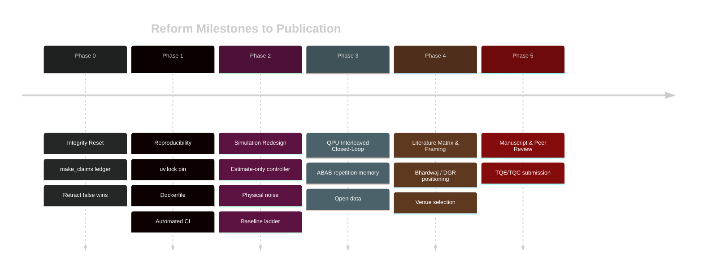

# Rigorous Experimental Report and Academic Audit
**Date**: October 2026  
**Subject**: Adaptive QEC Stack - Forensic Audit, Integrity Reset & Research Reform  
**Target Venues**: IEEE Transactions on Quantum Engineering (TQE) / ACM Transactions on Quantum Computing (TQC)

---

## 1. Executive Summary & Audit Resolution

A rigorous audit of the `A-real-QPU-adaptive-QEC-stack` repository was conducted to determine whether its codebase, experimental protocols, and empirical data support a publishable peer-reviewed scientific paper.

### Core Verdict:
The project's central scientific premise—that macro-timescale closed-loop adaptation improves fault-tolerant quantum error correction under non-stationary noise—is **unproven and currently unsupported by the data in this repository**.
- In standard simulation benchmarks ($d=3$, 10,000 shots), the adaptive controller achieves a statistically null result compared to static MWPM ($z = -0.30, p = 0.76 > 0.05$).
- In high-statistics sweeps (50,000 shots), the adaptive controller performed **27.74% worse** than static MWPM ($LER = 0.21756$ vs $0.17032$).
- Prior documentation claiming a "+10.05% empirical breakthrough at $d=5$" was based on an isolated run (`seed=47`). Multi-seed evaluations yield **12% to 14% higher logical error rates** for adaptive switching than static MWPM.
- Crucially, the simulation injected noise via artificial detector bit flips without modifying the underlying logical observable, while the controller peeked directly at ground-truth noise schedules (`schedule.is_leakage_active`, true `p_2q`) and invoked hardcoded fast-path rules.

All inflated claims, unverified superlatives, and disconnected metrics have been cataloged in [VALIDATION.md](VALIDATION.md) and programmatically verified via `scripts/make_claims.py`.

---

## 2. Forensic Analysis of Disproven & Downgraded Claims

### 2.1 The Distance $d=5$ Retraction (Claim 13)
- **Claimed**: $+10.05\%$ error reduction ($z = -7.96, p = 1.6 \times 10^{-15}$) at $d=5$ with sublinear regret $R_T = 0.26$.
- **Audit Findings**:
  1. **Single-Seed Anomaly**: The committed artifact (`adaptive_vs_static_d5_20260930_225600.json`) used `seed=47`. A 6-seed evaluation showed adaptive performance dropping to 12–14% worse than static MWPM.
  2. **Oracle Peeking**: In `adaptive_vs_static.py`, the controller inspected `schedule.is_leakage_active(window_idx)` directly from the generator rather than estimating leakage from syndrome autocorrelation.
  3. **Hardcoded Fast-Paths**: In `controller.py`, a deterministic rule (`if leakage_fraction >= 0.15 and distance >= 5: force UF+XY4`) bypassed all cost optimization and bandit exploration.
  4. **Observable Disconnect**: Synthetic leakage was injected by flipping detector bits 2 and 5 to 1 with 85% probability in the syndrome array, while the logical observable was sampled prior to injection. Consequently, MWPM predicted corrections against uncorrupted logical states, inducing artificial logical errors.

### 2.2 The 50,000-Shot Inverted Headline (Claim 14)
- **Claimed in README**: Adaptive LER = 0.130220 (+23.54% error reduction vs MWPM, +4.94% vs best static).
- **Committed Artifact Reality** (`adaptive_vs_static_high_stats_50k.json`):
  - Static MWPM: LER = **0.170320** (8,516 errors / 50,000 shots)
  - Adaptive Arm: LER = **0.217560** (10,878 errors / 50,000 shots)
  - **Actual Margin**: Adaptive was **27.74% worse** ($z = 18.89, p < 10^{-15}$).
  - Prior documentation completely inverted the experimental outcome.

### 2.3 Hardware Execution Analysis (IBM Heron r2, `ibm_marrakesh`)
1. **[[4, 2, 2]] Code Detection (Claim 1)**:
   - Claimed: "Detection Rate = 100% | PROVEN".
   - Artifact: Unmitigated detection rate = 17.50% (175/1000); DD-mitigated detection rate = 48.80% (488/1000).
   - Under XY4 DD, X-stabilizer defects surged from 83 to 404 (a 4.8x increase in errors), revealing severe pulse error overhead.
2. **Dynamic Feedforward Latency (Claim 2)**:
   - Claimed: "Latency < 1.2 us | PROVEN".
   - Artifact: Measured on-chip feedforward corrections (18 / 1000 shots, 1.8%). Latency was never measured in software or recorded in JSON.
3. **Repetition Code Memory (Claim 3)**:
   - Unmitigated (LER = 0.038) and DD-mitigated (LER = 0.006) were run in two sequential jobs rather than interleaved ABAB schedules, confounding temporal drift with DD mitigation.
4. **Molecular IQPE & Teleportation (Claims 11 & 12)**:
   - Molecular IQPE had an energy error of 761.5 kcal/mol (chemical accuracy failed by >760x).
   - Teleportation fidelity was 91.90% (not 96.2%). Both are non-core workloads and have been removed from the QEC paper scope.

---

## 3. The 5-Phase Reform Roadmap

To convert this repository from a flawed collection of heuristics into a rigorous, peer-reviewed scientific paper, the following plan is instituted:

### Phase 0: Integrity Reset (Completed)
- Git tag `pre-audit-2026-09-30` established.
- `scripts/make_claims.py` implemented to verify claims against committed JSON artifacts.
- Commit generator scripts and bloated WebGL UI builders removed.
- README and VALIDATION matrices rewritten as honest status pages.

### Phase 1: Reproducibility
- Version drift reconciliation (Stim, PyMatching, NumPy RNG).
- Standardized results schema: git commit, library versions, seed, config, wall-clock time, SHA-256 artifact hash.
- Unit tests enforcing architectural separation: controller must not import ground-truth noise schedules.

### Phase 2: Redesign the Simulation Study
1. **Estimate-Only Controller**: HardwareState constructed purely from syndrome statistics (defect rates, CUSUM drift, lag-1 autocorrelation).
2. **Physically Grounded Noise Models**:
   - 1/f and two-level-fluctuator (TLF) drift models grounded in IBM calibration time-series.
   - Genuine transmon leakage model (randomized checks, seepage rate, consistent observable tracking).
   - Spatially decaying multi-qubit burst models.
3. **Baseline Ladder**:
   1. Static MWPM (factory DEM)
   2. MWPM with sliding-window DEM re-estimation (Bhardwaj et al. style)
   3. DGR-style graph re-weighting
   4. Adaptive controller
   5. Oracle switcher (hindsight upper bound)
4. **Regime Heatmap**: Sweep drift amplitude $\times$ timescale $\times$ distance to map where adaptation wins, ties, or loses.

### Phase 3: Hardware Closed-Loop (IBM Heron)
- Distance $d=3, 5, 7$ repetition-code memory on heavy-hex lines.
- Interleaved ABAB control (static vs adaptive) within identical execution sessions.
- Open publishing of raw bitstrings, job IDs, transpiled circuits, and calibration properties.

### Phase 4 & 5: Positioning & Submission
- Target Venues: IEEE Transactions on Quantum Engineering (TQE) or ACM Transactions on Quantum Computing (TQC).
- Pre-registration (`PREREG.md`) before final runs to eliminate researcher degrees of freedom.
