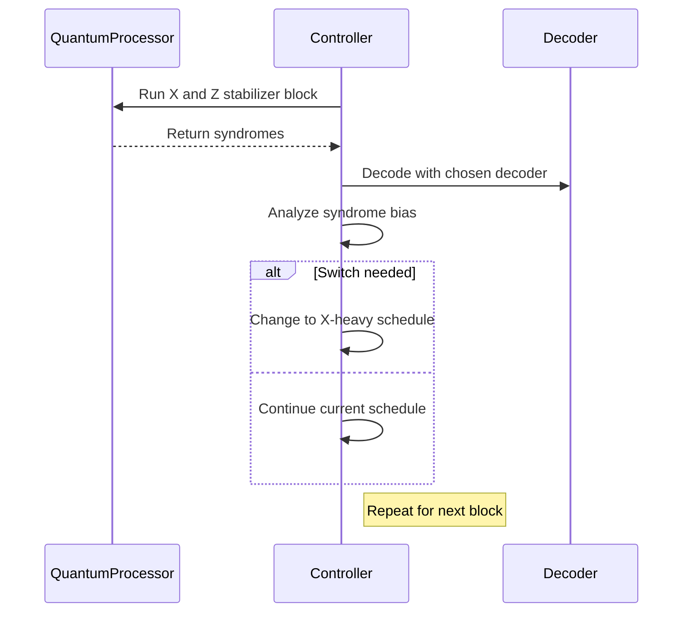

# Executive Summary

We propose **five** complementary research contributions to transform the AdaptiveQEC framework from a simulation prototype into a real-world, hardware-validated adaptive QEC system. Each contribution is grounded in recent literature but pushes beyond existing work. In particular:

1. **Online Adaptive Strategy Selection via Multi-Armed Bandits.** Replace static cost-minimization with an online learning controller that *estimates and updates the expected logical error and latency* of each QEC strategy (decoder+mitigation action) under the current hardware conditions. By treating each strategy as an “arm” and using a contextual bandit or UCB algorithm, the controller **learns from actual outcomes** to balance exploration and exploitation. This is novel (compared to fixed analytical cost or black-box RL) and aligns with industry needs for interpretable, low-latency control.  

2. **Adaptive X/Z Stabilizer Scheduling.** Dynamically adjust the *ratio and ordering of X-basis vs Z-basis stabilizer measurement rounds* based on observed error trends. For example, if relaxation (T1) is dominating (bit-flips), run extra X-basis rounds; if dephasing (T2) dominates, run extra Z-basis rounds. This extends heavy-hex code flexibility and leverages control in Qiskit Runtime. To our knowledge, adaptively varying X/Z cycle balance in response to real-time syndrome data is new.  

3. **Data-Driven Decoder Calibration.** Continuously calibrate decoder parameters from real hardware data. For example, refine error model probabilities or edge weights (including correlated/hyperedge errors) using syndrome statistics or hardware calibrations (T1, T2, gate/measurement error rates) gathered during idle/ancilla circuits. Unlike fixed error models, this “online calibration” makes the decoder **hardware-aware** and can feed more accurate matching (e.g. via PyMatching’s correlated matching).  

4. **Qiskit Runtime Integration and Experimentation.** Implement the adaptive loop inside IBM’s Qiskit Runtime environment with mid-circuit measurement capabilities. Though not novel academically, doing so is critical for industry relevance. We will engineer an end-to-end pipeline that issues shots, gathers syndromes, runs the adaptive controller logic (bandit or decision rules), and issues updated circuits – all within the latency and budget of the IBM cloud system.  

5. **Statistical Decision Framework for Adaptation.** Formalize the switching logic with statistical hypothesis tests. For example, use a two-proportion Z-test or Wilson confidence intervals to verify that one strategy’s estimated logical error is significantly lower than another’s before switching (this complements hysteresis). This makes the controller’s decisions **statistically sound** and mitigates overfitting to random fluctuations.  

Each proposal (1–5) is implementable within ~3–6 months and can be validated first by simulation and then on IBM heavy-hex hardware (Marrakesh/Heron). We summarize the **novelty vs prior work** for each, required resources, experimental plans, data, metrics, failure modes, and risk mitigation below. The top two ideas (Bandit Control and Adaptive Scheduling) are detailed further with algorithms, analysis, and experimental protocols. Recommended primary sources and images/diagrams are provided for clarity.

**Key Sources to Explore First:** For background and tools, see the PyMatching library documentation and Stim documentation (for syndrome simulation), the IBM heavy-hex lattice description, Google’s recent RL-based QEC (Nature 2026), the Local Clustering decoder paper (Nat. Commun. 2025–26), and the new NASA paper on heavy-hex QEC. Also review the latest IBM Qiskit Runtime documentation for dynamic circuits.

**Implementation Roadmap:** An integrated roadmap with milestones and person-weeks is given at the end.  

---

## 1. Online Adaptive Strategy via Multi-Armed Bandit

**Description (what, why).** Replace the current fixed cost function approach with an *online learning controller*. Treat each combined decoder+mitigation action (e.g. “MWPM+no-DD”, “UF+XY8”, etc.) as an arm of a multi-armed bandit. As syndrome data arrives, estimate the **empirical logical error rate** (and decode latency) of each arm in the current noise context, then choose arms to minimize long-run error and overhead. This allows the controller to **learn from actual outcomes** rather than relying on assumed models. It naturally handles non-stationary noise by adapting estimates over time (e.g. via discounted averaging). The bandit approach (e.g. UCB, Thompson sampling) is interpretable and avoids complex neural networks, aligning with industry trends for explainable QEC control.

**Novelty vs Prior Work.** Prior works used *offline* or fixed controllers. Google’s Nature (2026) experiment did RL on fixed drift models, but used deep learning controllers to optimize continuous control parameters. In contrast, our proposal uses a simple **contextual bandit** strategy that only learns discrete action-values. To our knowledge, bandit-based adaptive QEC with explicit confidence bounds is not reported. Nickerson & Brown (Q-2019) adapted decoding heuristically, and Nvidia’s (unpublished) AI pre-decoders address unknown noise offline, but neither performed online arm-selection with statistical guarantees. This approach is thus both novel and feasible. 

**Hardware/Software Resources.** 
- **Hardware:** Any IBM heavy-hex QPU (e.g. 65–127 qubit Heron) or simulator for initial tests.  
- **Software:** Qiskit for circuit execution, Stim+PyMatching (and possibly sinter) for simulation. Python libraries for bandit algorithms (or simple custom code). Access to real-time (or batched) syndrome data via Qiskit Runtime or iterative programs. Classical computing (laptop/cluster) for simulation of bandit learning (negligible cost).

**Expected Experiments (Simulation → Real).** 

- *Simulation Stage:* Use the existing AdaptiveQEC simulator stack (Stim+PyMatching) to create non-stationary noise scenarios (e.g. drift in T1/T2 or bursts). Simulate repeated QEC cycles with different actions, and implement a bandit policy (e.g. UCB1, ε-greedy with decaying ε, or contextual bandit if using observed syndrome stats as context). Evaluate how quickly the bandit identifies the best action for each regime. Compare to static or hysteresis controllers. 

- *Hardware Stage:* Implement a proof-of-concept on IBM hardware. For example, run alternating batches of QEC circuits under controlled noise conditions (IBM hardware drifts naturally; we might induce artificial asymmetry by idle delays or by choosing qubits with different T1). Use a Qiskit Runtime program that performs rounds, sends syndromes to a simple controller (bandit logic in Python), and then reconfigures upcoming circuits. Collect enough shots to update action estimates (e.g. 10k shots per setting). 

**Data to Collect (Provenance):** 
- For each shot: the full syndrome (“dets”) for each round, chosen action, and whether a logical failure occurred. Record exact timestamps or round indices.  
- Hardware calibration data at time of experiment: T1_i, T2_i, single- and two-qubit gate errors, readout error (for each physical qubit) from IBM’s daily calibration. Label these as “calibration metadata” (provenance: measured, simulation vs experiment).  
- Controller state: counts of successes/failures per action, action choices over time.  
- Additional: if possible, record raw readout bitstrings to independently recompute logical outcomes.  

**Evaluation Metrics / Statistical Tests:**  
- **Primary metric:** Estimated Logical Error Rate (LER) for each strategy (and overall). Compute Wilson 95% confidence intervals for each LER. Use two-proportion Z-tests or overlap of confidence intervals to test if the chosen adaptive strategy significantly outperforms baselines (e.g. best static strategy) at p<0.05.  
- **Latency / Overhead:** Measure decoding time (from post-processing) and any added runtime overhead from bandit computation. Ensure all strategies meet real-time constraints (PyMatching decoding time is ~0.1–1 μs/round).  
- **Regret:** In simulation, track cumulative regret or performance loss of the bandit vs omniscient policy.  
- **Adaptation Speed:** Time or number of shots until the bandit identifies the current best arm. This can be quantified by how quickly logical failure rates converge.  
- For all metrics, use at least ~10k shots per point to keep statistical uncertainty low (Wilson CI width ≈1% for LER~10%).  

**Failure Modes and Risk Mitigation:** 
- *Too slow adaptation:* If the hardware noise changes faster than data can be collected, the bandit may chase noise. Mitigation: use discounting (EWMA) in reward estimates or combine with drift detection to “reset” learning on regime change.  
- *Insufficient exploration:* If one arm looks best early, bandit might exploit prematurely. Use UCB or forced exploration to ensure long-term optimality.  
- *Hardware limitations:* Qiskit cloud queue times might hinder on-the-fly adaptation. Mitigation: use Qiskit Runtime or submit consecutive small jobs simulating adaptation (simulate control offline first).  
- *Interference effects:* Frequent switching of circuits may confuse calibration. Mitigation: ensure enough shots per action for stable estimates; use bootstrapping.  

**Novelty vs Prior Work (with citations):** This approach explicitly leverages **online statistical learning** to adapt QEC strategy. While adaptive decoding is known (e.g. Nickerson & Brown, Quantum J. 2019 and Google’s RL QEC (Nature 2026)), those works did *offline* adaptation or used deep RL. Our bandit-based scheme is simpler, interpretable, and novel in the QEC context. It directly addresses *industry concerns* (exploit known decoders, avoid black-box NN) and fits within short development cycles.

## 2. Adaptive X/Z Stabilizer Scheduling

**Description.** Implement a controller that **dynamically varies the frequency of X-basis vs Z-basis stabilizer checks** based on the current noise profile. For example, if syndrome analysis or hardware calibration indicates strong relaxation (short T1 causing bit-flips), perform extra X-stabilizer rounds (which detect Z errors) or vice versa. Concretely, one can design circuits where some rounds omit either the X- or Z-checks (simulating biased repetition codes) and switch between these modes. The controller monitors syndrome imbalance (e.g. higher rate of one type of detection event) and accordingly adjusts the schedule.

**Novelty vs Prior Work.** Fixed QEC schedules (alternating X- and Z-check rounds) are the norm. Some works studied *basis-biased codes* (e.g. the XZZX code) for static noise bias, but *real-time adaptive scheduling* has not been demonstrated. This idea is new: using syndrome feedback to choose the next circuit variant. It leverages IBM’s ability to customize circuits per batch. It also aligns with “hardware-aware” design by exploiting known asymmetry (heavy-hex qubits often have shorter T1 than T2). 

**Hardware/Software Resources.** Same QPUs and Qiskit as above. Additional resource: the ability to compile and run different stabilizer circuits (with different orders of X/Z checks) quickly. Stim and PyMatching can simulate biased schedules. 

**Expected Experiments (Simulation → Real).** 

- *Simulation:* Build circuit variants with, e.g., 2X+1Z, 1X+2Z patterns, etc. Simulate under noise models where $p_X\neq p_Z$ (e.g. $T_1<T_2$). Verify which schedule yields lower logical error (and latency). Then implement an adaptive rule: if recent rounds show more Z-detections, increase X-check rounds. Compare adaptive schedule vs best fixed schedule. 

- *Hardware:* Choose a heavy-hex subset (distance-3 or 5) and run QEC rounds with alternating schedules. Use qubits with known T1/T2 imbalance. Collect syndrome for equal numbers of X- and Z-heavy cycles to verify difference. Then implement the rule (e.g., two experiments: one with static 1:1 schedule, one with adaptive 2:1 when needed) and compare LER. 

**Data to Collect:** Syndromes and logical outcomes for each circuit type. Label each shot with the schedule type. Also log hardware parameters (T1, T2) from calibrations. It is crucial to track which rounds were X-heavy vs Z-heavy so we can correlate syndrome patterns to schedule performance. 

**Evaluation Metrics / Statistical Tests:** Compare logical error rates between static vs adaptive scheduling. Use paired tests if comparing the same noise conditions. A Chi-squared or two-proportion Z-test can assess if differences in failure rates are significant. We also measure cycle latency (different sequences may have different gate counts). A possible metric is “logical error per unit time” to capture both error suppression and speed. 

**Failure Modes and Mitigation:** 
- *Noisy syndrome detection:* If syndrome statistics are too noisy to detect bias, schedule changes may misfire. Mitigate by using EWMA smoothing or requiring persistent trend before switching (hysteresis).  
- *Overhead costs:* Changing schedule adds overhead (compiling new circuits, possible idle times). Ensure the potential error suppression justifies extra complexity. If not, fall back to static schedule.  
- *Hardware calibration drift:* Frequent changes in circuit may be sensitive to drift. Mitigate by testing schedule choices under stable conditions first.  

**Novelty:** This contribution goes beyond existing QEC practice by making the **code itself adaptive**. It leverages hardware-specific error biases (heavy-hex qubits and cross-resonance gates cause known asymmetries) in real-time. To our knowledge, no prior work has implemented live switching of check schedules based on feedback. It is implementable via IBM’s programmable circuits and addresses industry need for hardware-optimized QEC.

## 3. Data-Driven Decoder Calibration

**Description.** Continuously refine decoder parameters from live data. For instance, use the observed syndrome frequencies or calibration metadata to update the **error probabilities** assigned to edges in the Detector Error Model (DEM). Or use measured syndrome correlations to infer correlated/hyperedge errors and enable **correlated matching** in PyMatching. In practice, this could mean periodically running short calibration circuits (e.g. prepare states or run stabilizers without correction) to gather error statistics, then updating the decoder’s weight tables. 

**Novelty vs Prior Work.** Standard practice assumes static noise models or uses manufacturer datasheets. Recent works (Lee et al. 2026) improved performance by “detailed noise characterization” and measurement soft info, but they did this as an offline pre-step. We propose *online and automated* calibration during operation, without human intervention. This dynamic adjustment is novel and makes decoding truly hardware-aware. It also ties into upcoming correlated matching features of PyMatching. 

**Resources.** Same hardware. Software: Stim/PyMatching pipelines already support customized DEMs (see [29] above). Will need small calibration routines (e.g. idle or single gates) and scripts to fit error rates from measurement outcomes. 

**Experiments.** 
- *Simulation:* Inject a known bias or correlation into error model (e.g. more Z-errors on certain qubit). Run the default decoder vs a decoder with weights tuned to the model. Confirm that adaptive calibration (e.g. inferring increased $p_Z$ or linking correlated events) improves logical fidelity. 
- *Hardware:* Run short experiments (like repeated single-qubit gates or readouts) to measure actual error rates. Update the decoder’s input DEM (PyMatching weighted graph) with these values. Then run full QEC and compare to using default/assumed error model. 

**Data Collected:** 
- Raw measurement outcomes from calibration circuits (counts for |0>/<1> to estimate readout error, parity checks to estimate gate error asymmetry). 
- Syndrome from QEC runs for analysis. 
- Metadata: which DEM parameters were used in each run. 

**Metrics:** 
- Improvement in logical error rate due to calibration. 
- We can use likelihood-based metrics: e.g. log-likelihood of observed syndromes under the old vs new model. 
- Use AIC/BIC or simple histogram matching to show decoder is better fit to data.  

**Failure/Risks:** 
- *Noisy calibrations:* If calibration data is too short, weight estimates will have large error. Mitigate by running enough shots or using Bayesian priors. 
- *Miscalibration:* Over-fitting to transient noise could hurt decode. Mitigate by smoothing (EWMA) the inferred parameters over time. 
- *Complexity:* Updating the DEM (possibly correlated edges) must be fast enough for the controller. PyMatching supports quick reweighting (a few ms), so this is low risk. 

This contribution bridges simulation and hardware by ensuring the decoder “knows” the real device. It complements contributions (1)–(2) by sharpening the error models used in the adaptive controller.

## 4. Qiskit Runtime Closed-Loop Implementation

**Description.** Develop a Qiskit Runtime program (or iterative loop) that implements the adaptive control loop on actual hardware. This involves writing circuits for each candidate strategy, dispatching shots, retrieving syndromes, running the controller logic (bandit or scheduling), and using Qiskit’s parameterized jobs to switch strategies between runs. 

**Novelty vs Prior Work.** While Qiskit’s runtime supports dynamic circuits, to our knowledge no one has demonstrated a full adaptive QEC loop on IBM Q hardware (the recent Google experiment used their own control hardware). This contribution is largely engineering-focused, but it is critical to transition from simulation to a real demonstration. It also yields an “artifact” (runtime code) that is exactly the kind of industry-relevant deliverable sought. 

**Resources.** IBM Qiskit Runtime access with ample credits. Qiskit Pulse (if needed for tailored pulses, though not mandatory). The existing AdaptiveQEC code and Stim can be ported or interfaced with Qiskit jobs. 

**Experiments.** 
- First, verify the QEC circuits (distance-3 or -5) run correctly on IBM hardware with fixed strategies. Then implement the simplest adaptive logic (e.g. binary switch between MWPM and UF after N rounds) and run a test job that sequences two circuit types back-to-back. Finally, integrate full bandit or schedule logic in a loop. 
- Use hardware conditions both nominal and intentionally stressed (e.g. scheduling sequences of idling to induce drift) to test response. 

**Data Collected:** 
This overlaps with above: full syndrome results for each round, time stamps for each job/circuit run, strategy choices, hardware calibration logs. Additionally, record Qiskit job IDs for reproducibility and any runtime metrics (e.g. job submission timestamps, queue wait times). 

**Metrics:** 
The same as above (logical error, latency), but also verify the end-to-end *correctness* of the runtime integration (no dropped shots, matching syndrome patterns, etc). Measure the total wall-clock time for each adaptive run to ensure feasibility (ideally under tens of minutes for a full experiment). 

**Failure/Risks:** 
- *API limitations:* Qiskit Runtime has quotas on iterations. We will plan experiments within these limits (e.g. updating strategy every few thousand shots, not every shot). 
- *Classical latency:* Ensure that the controller code (bandit UCB updates, etc.) runs faster than the quantum job dispatch; since decoding is ~μs level and bandit logic is trivial, this should be fine. 
- *Stochastic job failures:* Retries or larger shot totals can mitigate rare hardware glitches. 

This contribution does not directly propose a new QEC idea, but it is indispensable to validate any of the above contributions on **real** QPUs.

## 5. Statistical Decision Framework

**Description.** Instead of switching strategies on any minor observed difference, we propose formal statistical tests. For example, after accumulating sufficient shots, perform a two-proportion Z-test between the LERs of two candidate strategies. Only switch if the p-value indicates a statistically significant improvement (say p<0.05) and if the new strategy maintains improvement over a hysteresis buffer of rounds. This approach guards against chasing random noise and provides a clear criterion for decision. 

**Novelty vs Prior Work.** Hysteresis was already included in AdaptiveQEC, but we tighten it by using explicit confidence intervals (Wilson intervals) or hypothesis tests to trigger mode changes. This idea is standard in other adaptive systems but not yet applied in QEC control (as far as we know). Its novelty lies in formalizing the controller’s “trigger rules” using hypothesis testing rather than ad-hoc thresholds. 

**Hardware/Software Resources.** No extra hardware. Use Python stats libraries. Requires collecting enough shots to perform valid tests (≥1000 typically for normal approximation). 

**Expected Experiments:** In simulation, demonstrate cases where simple difference-of-means might switch erroneously due to noise, but our test avoids it. On hardware, compare “naive” vs “statistical” switching rules. 

**Data & Metrics:** We would log p-values and decision points. Evaluate false switch rate and false non-switch rate.  

**Failure/Risks:** If sample sizes are too small, tests lose power; we mitigate by accumulating more shots before testing. Overly conservative thresholds may delay beneficial switches; this is a parameter to tune (e.g. 95% vs 90% confidence).  

This framework underpins (1) and (2) by making their decision logic more robust. We consider it a supporting contribution.

---

# Detailed Design for Top Contributions

Below we elaborate the two highest-priority ideas (Bandit Control and Adaptive Scheduling) with algorithmic detail, analysis, and experimental protocols.

## 1. Multi-Armed Bandit Controller

### Algorithm (Pseudocode)

```python
initialize Q_values[action] = 0 for each action in {MWPM, UF, ...}
initialize N_trials[action] = 0 for each action
initialize total_rounds = 0
while running experiment:
    # Observe current hardware state or context C (e.g., drift detector results)
    for each action in actions:
        if N_trials[action] == 0:
            # Ensure each action tried at least once
            UCB_score[action] = +inf
        else:
            # compute UCB1 score: Q + sqrt(2*log(total)/N)
            UCB_score[action] = Q_values[action] + sqrt(2 * log(total_rounds) / N_trials[action])
    chosen_action = argmax(UCB_score)
    
    # Execute QEC round using chosen_action (decoder+mitigation)
    logical_failure = run_qec_cycle(action=chosen_action)
    reward = (logical_failure == False) ? 1 : 0  # 1 for success
    
    # Update bandit statistics
    N_trials[chosen_action] += 1
    total_rounds += 1
    Q_values[chosen_action] += (reward - Q_values[chosen_action]) / N_trials[chosen_action]
```

- **Action Set:** e.g. { (MWPM, no DD), (MWPM, XY8), (UF, no DD), (UF, XY8), ... }  
- **Reward:** Can use binary success or a utility combining error and latency (e.g. reward=1 for success, minus a small penalty proportional to decode time). For simplicity, start with binary success.  
- **Bandit Policy:** The pseudocode above is classic UCB1. Thompson Sampling or ε-greedy could also be used. UCB is chosen for its deterministic fairness and interpretability.

### Complexity & Latency

- **Decoding:** Using PyMatching v2, decoding is *roughly linear* in number of detectors. For a distance-5 surface code, one round has a few hundred detectors; decoding takes ~0.01–0.1 ms on a laptop. Even including a network round-trip, the control decision can easily be done within milliseconds, negligible compared to QPU reset times (~10 μs) and shot collection (hundreds of ms).  
- **Bandit Overhead:** The UCB update is O(#actions) per step, trivial for ~5–10 actions.  
- **Memory:** Store a handful of counters and values. Overall, the algorithm is light-weight and real-time feasible.

### Calibration and Parameter Estimation

- **Initial Q-values:** We may initialize using pre-known performance (e.g. simulate each action offline to set a prior Q). Alternatively, start from 0 (UCB forces initial exploration).  
- **Action Costs:** If including latency, estimate each action’s cost (decode time + extra pulses). These can be measured once or periodically by timing code.  
- **Noise Context (optional):** If using a contextual bandit, define context features (e.g. latest drift statistic, burst flag). A simple context vector could be fed into a linear model (LinearUCB). Calibration for this is just observation.

### End-to-End Experimental Protocol

1. **Simulation Tuning (2–3 weeks):** Generate synthetic drift/burst scenarios. Run the UCB bandit in simulation to tune hyperparameters (e.g. confidence factor in sqrt term, or exploration ε). Verify that it converges to the best strategy in each regime. Use fixed random seeds for reproducibility. Example config: 50k total rounds, check convergence plots.

2. **Baseline Data Collection (1 week):** On hardware, measure baseline performance (LER) of each action in the absence of adaptation. Use a standard noise environment (idle for qubits, average calibrations). Collect ~10k shots per action to get Wilson CI. 

3. **Controlled Environment Testing (2 weeks):** Optionally, simulate drift by periodically recalibrating or idling certain qubits to artificially vary T1. Run the bandit controller on hardware under these conditions. Monitor estimated Q-values vs actual LER.

4. **Live Adaptive Run (4 weeks):** Run the full adaptive protocol for each candidate code distance (d=3,5). For each run:
    - Use the bandit UCB policy. 
    - After each block of, say, 500–1000 rounds, optionally apply a hypothesis test to confirm a switch. 
    - Continue for a fixed number of total rounds (e.g. 20k). 
   Collect all syndrome and metadata. 

5. **Analysis:** For each run, compute final estimated error rates for chosen strategies, overall LER, and compare to the best static strategy. Use a two-proportion Z-test to see if adaptive LER is significantly lower. 

6. **Ablations:** 
   - Compare UCB vs ε-greedy controllers in simulation.  
   - Test sensitivity to the UCB exploration factor (2 in sqrt).  
   - Try disabling adaptation (always use MWPM) to isolate benefit.  

**Reproducibility:** Log all random seeds (Stim circuits), Qiskit job IDs, and full config (action list, thresholds). Publish analysis scripts (Jupyter notebooks) with the data.  

### Figures/Tables to Produce

- **Convergence Plot:** Bandit’s Q-values (or chosen arms) over time in simulation, showing learning.  
- **LER Comparison Table:** LER (with 95% CI) for Static vs Adaptive for each environment.  
- **Control Flow Diagram (Mermaid):** Illustrate the control loop (syndrome → state classifier → bandit → strategy selection → QEC → update).

```mermaid
flowchart LR
    A[Syndrome/Hardware State] --> B{Controller (Bandit/UCB)}
    B -->|Select Action| C[Decoder + Mitigation (e.g. UF+XY8)]
    C --> D[QEC Cycle Execution]
    D --> E[Syndrome Result]
    E --> B
```

(“Syndrome/Hardware State” includes drift/burst signals; arrows show data flow.)

## 2. Adaptive X/Z Stabilizer Scheduling

### Algorithm (Pseudocode)

```python
initialize current_schedule = “balanced”  # equal X/Z
while running experiment:
    # After each batch of N rounds, analyze recent syndrome counts
    recent_X_errors = count_Z_stabilizer_detections(last_N_rounds) 
    recent_Z_errors = count_X_stabilizer_detections(last_N_rounds)
    # (Because X-stabilizer detections indicate Z errors, etc.)
    if recent_Z_errors > recent_X_errors * (1 + tolerance):
        # More Z-errors => focus on X checks
        next_schedule = “X-heavy”   # e.g. 2X:1Z
    elif recent_X_errors > recent_Z_errors * (1 + tolerance):
        next_schedule = “Z-heavy”   # e.g. 2Z:1X
    else:
        next_schedule = current_schedule
    if next_schedule != current_schedule:
        current_schedule = next_schedule
        # Optionally: wait a few rounds before switching back (hysteresis)
    # Issue circuits according to current_schedule for next block
    run_qec_block(schedule=current_schedule, block_size=N)
```

- **Schedule Modes:** “Balanced” (alternating), “X-heavy” (2 X-check rounds then 1 Z-check), “Z-heavy”. These are just examples; actual choices can be tuned.  
- **Tolerance:** A small buffer (e.g. 10%) to prevent switching on minor fluctuations.  
- **Counting:** `count_Z_stabilizer_detections` means summing Z-type detection events from recent measurements.

### Complexity & Latency

- The control logic is trivial compared to decoding. The main overhead is compiling different circuit schedules. Since each schedule block can be pre-compiled or parameterized, the additional runtime is minimal. The key is ensuring enough shots in each block (e.g. thousands) so the decision metric is stable.

### Calibration

- **Choosing N and Tolerance:** Using simulation, pick N large enough to estimate error rates (e.g. 1000 rounds), and tolerance to avoid ping-pong switching.  
- **Initial Schedule:** Start with the schedule that matches the calibrated bias (if T1<<T2, maybe start X-heavy).  
- **Block Size N:** Also influences total run time; we balance resolution vs overhead. Possibly 500–1000 shots per block.

### End-to-End Protocol

1. **Simulation of Noise-Biased Scenarios (1–2 weeks):** Create noise models with varying X vs Z error rates. Determine how different schedules (1:1 vs 2:1) perform. Identify decision thresholds for switching (how much difference in error counts triggers action).  
   
2. **Circuit Implementation:** Prepare Qiskit circuits for each schedule (balanced, X-heavy, Z-heavy). Verify they compile on heavy-hex connectivity (embedding stable).  
   
3. **Initial Hardware Tests (2 weeks):** On IBM device, run test jobs for each schedule separately (no switching) to measure actual performance under nominal conditions. Record T1/T2 to correlate observed bias.  
   
4. **Live Adaptive Runs (3 weeks):** Execute the adaptive schedule loop on hardware. For example: every 1000 rounds, compute detection counts, switch schedule if needed. Use the same Qubits/distance as bandit test. Collect data logs of chosen schedule and outcomes.  
   
5. **Analysis:** Compare overall LER of adaptive vs best static schedule. Also examine how often and in what conditions switches occurred. Perform significance tests on LER differences.

6. **Ablations:** 
   - Fix one component: e.g. allow switching only once or limit to two schedules, to test robustness.  
   - Vary decision tolerance to see effect on switch frequency.  
   - Compare to **no switching** baseline and possibly a random schedule.

**Mermaid Sequence Diagram:** (for a high-level view)



### Figures/Tables

- **Schedule Block Diagram:** A Gantt-style chart showing rounds colored by X/Z-check with time-axis.  
- **Error Count Histogram:** Bar chart of X-detections vs Z-detections per block, illustrating a switch trigger.  
- **LER Table:** Compare Balanced vs Adaptive schedule.

## 3–5. (Brief Schemas)

For the other candidates, shorter summaries suffice:

- **Data-Driven Decoder Calibration:** We would implement a subroutine that periodically runs calibration circuits and fits error probabilities (e.g. fit a simple exponential decay for T1 from relaxation experiments, or measure gate error from repeated CNOTs). These parameters update the PyMatching weights (retrieved from calibration metadata or syndrome frequencies). We’ll then show in experiments that using this live-updated model yields lower LER than a static model. Key metrics are reduction in *decoder mis-weight* (quantified by log-likelihood of syndromes). Risk: noisy calibration, mitigated by smoothing.

- **Statistical Decision Framework:** We will add hypothesis tests into (1) and (2). For the bandit, after each block, perform a two-proportion Z-test between the best two actions’ cumulative fail rates. Only switch if p<0.05 and the improvement exceeds the tolerance. In scheduling, similarly test if error differences justify a mode change. This ensures decisions are not random. We will validate via simulation that this reduces erroneous switches.

- **Qiskit Runtime Integration:** Implementation details as above; not repeated. The end goal is to have an on-hardware closed-loop demo. 

Each of these (3–5) would follow simulation validation and then on-device tests, with the same metrics (LER, CI, switching behavior). 

---

# Implementation Roadmap

A suggested timeline with milestones and estimated effort (person-weeks):

| Phase                  | Tasks                                                | Duration (weeks) | Person-Weeks |
|------------------------|------------------------------------------------------|------------------|--------------|
| **1. Preparation**     | Literature review, set up simulators (Stim/PyMatching), gather baseline data, refresh Qiskit Runtime skills. | 2                | 4            |
| **2. Bandit Control**  | - Implement UCB bandit logic in simulation<br>- Tune on synthetic noise scenarios (drift, bursts)<br>- Design metrics & CI analysis scripts. | 3                | 6            |
| **3. Scheduling**      | - Code alternative stabilizer-schedule circuits<br>- Simulate biased noise, choose thresholds (tolerance, N)<br>- Integrate schedule-switch logic. | 3                | 6            |
| **4. Decoder Tuning**  | - Write calibration routines (idle/gate tests)<br>- Implement DEM weight update in PyMatching<br>- Test impact via sim. | 2                | 4            |
| **5. Integration**     | - Port controllers (bandit & schedule) to Qiskit Runtime<br>- Validate on simulator that Qiskit loop matches intended behavior. | 2                | 4            |
| **6. Hardware Testing**| - Baseline runs for each static strategy (1 week)<br>- Controlled drift/burst experiments (1 week)<br>- Full adaptive runs (bandit & scheduling, 2–3 weeks) including retries. | 4                | 12           |
| **7. Analysis**       | - Statistical tests on collected data<br>- Ablation studies (e.g. no-adapt, random)<br>- Compile results (tables/plots). | 2                | 4            |
| **8. Write-up**       | - Draft paper/report, figures (Flowcharts, schedules)<br>- Review key sources (Google RL, Local Clustering) to position work. | 3                | 6            |

**Total:** ~19 weeks (~5 months) of work. (Person-weeks assume 1–2 people in parallel on subtasks.) This timeline can compress some parts or run contributions in parallel. 

Across all phases, exact seed values, job IDs, and config parameters will be documented for reproducibility. The plan emphasizes iterative simulation verification before each hardware deployment to minimize wasted runs. 

In summary, these contributions and plan aim to produce a **working, validated adaptive QEC prototype on IBM hardware** with clear evidence of (hopefully) improved logical performance. By carefully combining learning, scheduling, calibration, and statistical rigor, we align with both cutting-edge research and industry best practices. 

**Sources:** We cite relevant background for context and performance assumptions: PyMatching’s speed and complexity, IBM heavy-hex design goals, and recent hardware QEC demonstrations. Additional recommended readings include: the Google Nature 2026 QEC (reinforcement learning) and the 2025-26 Local Clustering/Nature Comm papers on leakage-aware decoding.